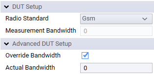
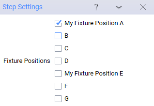

Appendix A: Attribute Details
=============================
## Display
The **Display** attribute is the most commonly used TAP attribute. This attribute:

-	Can be applied to class names (impacting the appearance in dialogs, such as the Add New Step dialog), or to properties (impacting appearance in the Step Settings Panel).
-	Has the following signature in its constructor:
```csharp
(string Name, string Description = "", string Group = null, double Order = 0D, bool Collapsed = false, string[] Groups = null)
```

-	Requires the **Name** parameter. All the other parameters are optional.
-	Supports a **Group** or **Groups** of parameters to enable you to organize the presentation of the items in the GUI.

The parameters are ordered starting with the most frequently used parameters first. The following examples show example code and the resulting GUI appearance:
```csharp
// Defining the name and description.
[Display("MyName", "MyDescription")]
public string NameAndDescription { get; set; }
```


See the examples in **`TAP_PATH\SDK Examples\PluginDevelopment\TestSteps\Attributes`** for different uses of the Display attribute.

Display has the following parameters:

| **Attribute**   | **Required** |**Description** |
| --      | --     |--------  |
| **Name**        | Required |The name displayed in the GUI. If the Display attribute is not used, the **property name** is used in the GUI. |
|**Description**  | Optional |Text displayed in tools tips, dialogs and editors in the GUI.|
|**Group/Groups** | Optional |Specifies an item’s group. Use **Group** if the item is in a one-level hierarchy or **Groups** if the item is in a hierarchy with two or more levels. The hierarchy is specified by the left-to-right order of the string array. Use either Group or Groups; do not use both. Groups is preferred. Groups are ordered according to the average order value of their child items. For test steps, the top-level group is always ordered alphabetically. Syntax: `Groups: new[] { "Group" , "Subgroup" }`|
|**Order**        | Optional |Specifies the display order for an item. Note that **Order** is supported for settings and properties, such as test step settings, DUT settings, and instrument settings. It does not support types: test steps, DUTs, instruments. These items are ordered alphabetically, with groups appearing before ungrouped items. Order is of type double, and can be negative. Order’s behavior matches the Microsoft behavior of the *Display.Order* attribute. If order is not specified, a default value of -10,000 is assumed. Items (ungrouped or within a group) are ranked so that items with lower order values precede those with higher values; alphabetically if order values are equal or not specified. To avoid confusion, we recommend that you set the order value for ungrouped items to negative values so that they appear at the top and Grouped items to a small range of values to avoid conflicts with other items (potentially specified in base classes). For example, if *Item A* has order = 100, and *Item B* has order = 50, *Item B* is ranked first.|

## EnabledIf
The **EnabledIf** attribute disables or enables settings properties based on other settings (or other properties) of the same object. The decorated settings reference another property of an object by name, and its value is compared to the value specified in an argument. Properties that are not settings can also be specified, which allows the implementation of more complex behaviors.

For test steps, if instrument, DUTs or other resource properties are disabled, the resources will not be opened when the test plan starts, However, if another step needs them they will still be opened.

The **HideIfDisabled** optional parameter of EnabledIf makes it possible to hide settings when they are disabled. This is useful to hide irrelevant information from the user.

Multiple EnabledIf statements can be used at the same time. In this case all of them must be enabled (following the logical *AND* behavior) to make the setting enabled. If another behavior is wanted, an extra property (hidden to the user) can be created and referenced to implement another logic. In interaction with HideIfDisabled, the enabling property of that specific EnabledIf attribute must return false for the property to be hidden.

In the following code, BandwidthOverride is enabled when **Radio Standard** = GSM. 
```csharp
public class EnabledIfExample : TestStep
{
    #region Settings

    // Radio Standard to set DUT to transmit.
    [Display("Radio Standard", Group: "DUT Setup", Order: 1)]
    public RadioStandard Standard { get; set; }

    // This setting is only used when Standard == LTE || Standard == HCDHA.
    [Display("Measurement Bandwidth", Group: "DUT Setup", Order: 2.1)]
    [EnabledIf("Standard", RadioStandard.Lte, RadioStandard.Wcdma)]
    public double Bandwidth { get; set; }

    // Only enabled when the Standard is set to GSM.
    [Display("Override Bandwidth", Group: "Advanced DUT Setup", Order: 3.1)]
    [EnabledIf("Standard", RadioStandard.Gsm, HideIfDisabled = true)]
    public bool BandwidthOverride { get; set; }

    // Only enabled when both Standard = GSM, and BandwidthOverride property is enabled.
    [Display("Override Bandwidth", Group: "Advanced DUT Setup", Order: 3.1)]
    [EnabledIf("Standard", RadioStandard.Gsm, HideIfDisabled = true)]
    [EnabledIf("BandwidthOverride", true, HideIfDisabled = true)]
    public double ActualBandwidth { get; set; }

    #endregion Settings
}
```
When **Radio Standard** is set to GSM in the step settings, both **Override Bandwidth** options are then displayed:



For an example, see `TAP_PATH\SDK Examples\PluginDevelopment\TestSteps\Attributes\EnabledIfAttributeExample.cs`.

## Flags Attribute
The **Flags** attribute is a C# attribute used with enumerations. This attribute indicates that an enumeration can be treated as a *bit field* (meaning, elements can be combined by bitwise OR operation). The enumeration constants must be defined in powers of two (for example 1, 2, 4, …).

Using the Flags attribute results in a multiple select GUI, as shown below:



## FilePath and DirectoryPath Attributes 
The FilePath and DirectoryPath attributes can be used on a string-type property to indicate the string is a file or a folder system path. When this attribute is present, the TAP GUI displays a browse button allowing the user to choose a file or folder. These attributes can be used as follows:
```csharp
[FilePath]
public string MyFilePath { get; set; }
```
This results in the following user control in the GUI:


The DirectoryPath attribute works the same as the FilePath attribute, but in the place of a file browse dialog, a directory browse dialog opens when the browse ('...') button is clicked.

## MetaData Attribute
Metadata is a set of data that describes and gives information about other data. The Metadata attribute marks a property as metadata. 

TAP can prompt the user for metadata. Two requirements must be met:

-	The MetaData attribute is used and the promptUser parameter is set to *true*
-	The *Allow Metadata Dialog* property in **Settings > Engine**, is set to *true*

If both requirements are met, a dialog (in TAP GUI) or prompt(in TAP CLI) will appear on each test plan run to ask the user for the appropriate values. This works for both TAP GUI and TAP CLI. An example of where metadata might be useful is when testing multiple DUTs in a row and the serial number must be typed in manually.

Values captured as metadata are provided to all the result listeners, and can be used in the macro system. See SimpleDut.cs for an example of the use of the MetaData attribute.

## Unit Attribute
The Unit attribute specifies the units for a setting. The GUI displays the units after the value (with a space separator). Compound units (watt-hours) should be hyphenated. Optionally, displayed units can insert engineering prefixes.

See the `TAP_PATH\SDK Examples\PluginDevelopment\TestSteps\Attributes\UnitAttributeExample.cs` file for an extensive example.

## XmlIgnore Attribute
The XmlIgnore attribute indicates that a setting should not be serialized. If XmlIgnore is set for a property, the property will not show up in the GUI. If you want to NOT serialize the setting AND show it in the GUI, then use the Browsable(true) attribute, as shown below:
```csharp
// Editable property not serialized to XML 
[Browsable(true)]
[XmlIgnore]
public double NotSerializedVisible { get; set; } 
```
Properties that represent instrument settings (like the one below) should not be serialized as they will result in run-time errors:
```csharp
[XmlIgnore]
public double Power
{ 
    set; { ScpiCommand(":SOURce:POWer:LEVel:IMMediate:AMPLitude {0}", value) }
    get; { return ScpiQuery<double>(":SOURce:POWer:LEVel:IMMediate:AMPLitude?"); }
}
```


