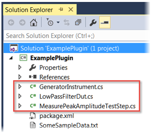
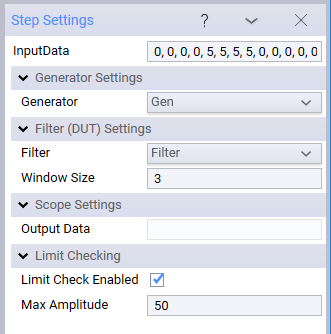
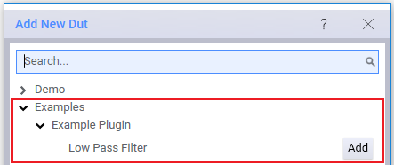
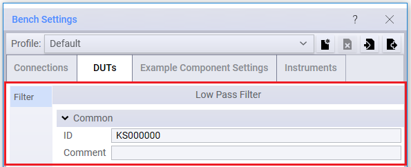
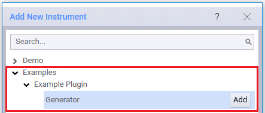
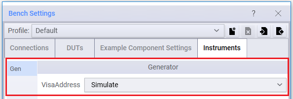
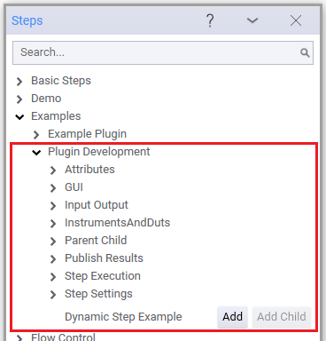
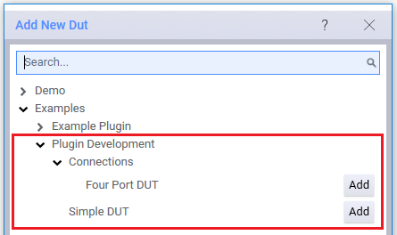
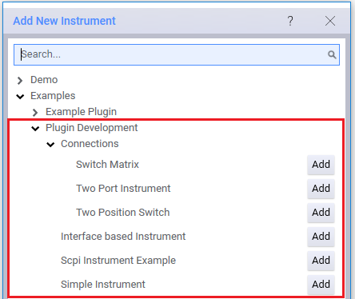

## Getting Started with the Visual Studio Example Projects
The Software Development Kit (SDK) package can be downloaded from opentap.io. If you are using the Keysight Developer's System (Community or Enterprice Edition) you already have the SDK package.

Before you start to create your own project, look at the projects and files in **`TAP_PATH\Packages\SDK\Examples`**. This folder provides code for example DUT, instrument and test step plugins. First-time OpenTAP developers should browse and build the projects, then use e.g. the Edtior GUI to view the example DUTs, instruments and test steps. 

SDK Examples contains the following:

| **Folder**  | **Description** |
| -------- | --------  |
| **`ExamplePlugin\ExamplePlugin.csproj`**                           | Creates a plugin package that contains one DUT resource, one Instrument resource, and one test step.   |
|**`PluginDevelopment\PluginDevelopment.csproj`**                    | Creates a plugin package that contains several test steps, two DUT resources, four Instrument resources, and two result listeners.                                              |
|**`TestPlanExecution\BuildTestPlan.Api\BuildTestPlan.Api.csproj`**  | Shows how to build, save and execute a test plan using OpenTAP API.  |
|**`TestPlanExecution\RunTestPlan.Api\RunTestPlan.Api.csproj`**      | Shows how to load and run a test plan using OpenTAP API.   |

See the following sections:

-	[Build and View the Example Plugin Project](#build-and-view-the-example-plugin-project) provides a quick overview on how to build this plugin and see its contents.
-	[Contents of the Plugin Development Project](#contents-of-the-plugin-development-project)  shows the many resources and test steps in this project. Follow the process in the previous section to build and view the project.
-	[Create a Project with the OpenTAP Plugin Template](#create-a-project-with-the-opentap-plugin-template) describes how to get started on your own project.

### Build and View the Example Plugin Project
The Example Plugin project creates a basic plugin package that contains a test step, a DUT resource, and an instrument resource. Follow these steps to build the project and view the results in OpenTAP: 

1. In Visual Studio:

    a.   Open **ExamplePlugin.csproj**. In the Solution Explorer, notice the three .cs files. These will create an instrument resource, a DUT resource, and a test step:
    
    

    
    b.	Select Debug > Start Debugging to build the solution and open it in OpenTAP.
    
2. 	In OpenTAP:

    a.	Click the **+** icon, and add the **Measure Peak Amplitude** step:
    
    
    
    b.	View the step settings. Notice, the step requires a Generator instrument:
    
     
     
    c. In the **Resource bar**, at the bottom of the GUI, click **DUTs Add New** or if you already have DUTs configured click on one of those. This launches the **Bench Settings** window. Click the **+** button and in the **Add New Dut** window add the **Low Pass Filter** DUT, then close the window:
    
    
    
    The **Bench Settings** window can also be launched from Settings > Bench > DUT.
    
    d.	In the **Bench Settings** window, notice the **Filter** DUT lets users to specify an ID and a Comment: 
    
    
    
    e. 	In **Bench Settings**, click the **Instruments** tab, then click the + button. Add the **Generator** instrument, then close the window:
    
    
    
    f.	Notice the **Generator** instrument allows users to specify the Visa Address:
    
    
    
3. 	Close OpenTAP. Do not save any files.
4. 	If you want to remove the examples, go to your Test Automation folder and delete:
    - OpenTAP.Plugins.ExamplePlugin.dll
    - OpenTAP.Plugins.ExamplePlugin.pdb

### Contents of the Plugin Development Project

Follow the same process to build and view the **Plugin Development** project (`TAP_PATH\Packages\SDK\Examples\PluginDevelopment\PluginDevelopment.csproj`), which contains many examples:

-	Several **test step** categories that contain a number of steps:

- 	Two **DUT** resources:
 	

-	Six Instrument resources:
	

-	Two Results Listeners:
	

To remove these examples, go to the installation folder and delete the **OpenTAP.Plugins.PluginDevelopment.dll** and **OpenTAP.Plugins.PluginDevelopment.pdb** files.

