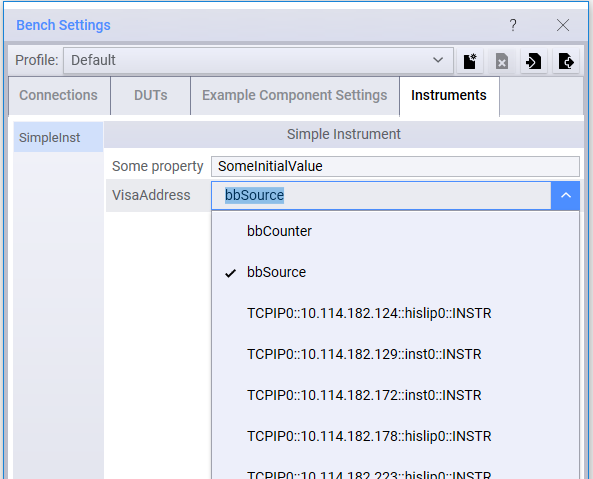

Instrument Plugin Development
=============================
Developing an instrument plugin is done by extending either the:

-	**Instrument class** (which extends *Resource*), or 
-	**ScpiInstrument** base class (which extends *Instrument*)

Keysight recommends using ScpiInstrument over the Instrument class when possible. 

Instrument plugins must implement the **Open** and **Close** methods:

-	The **Open** method is called before the test plan starts, and must execute successfully. The Open method should include any code necessary to configure the instrument prior to testing. All open methods on all classes that extend Resource are called in parallel, and prior to any use of the instrument in a test step.
-	The **Close** method is called after the test plan is done. The Close method should include any code necessary to configure the instrument to a safe condition after testing. The Close method will also be called if testing is halted early. All close methods are called in parallel, and after any use of the instrument in a test step. 

Developers should add appropriate properties to the plugin code to allow:

-	Configuration of the instrument during setup. The Instrument base class has no predefined properties. The ScpiInstrument base class has a string property that represents the **VisaAddress** (see [SCPI Instruments](#scpi-instruments) below).
-	Control of the instrument during the execution of test steps. 

Similar to DUTs, instruments must be preconfigured via the **Bench** menu choice, and tests will use the first instrument found that matches the type they need.
For instrument plugin development examples, see the files in:

-	`TAP_PATH\Packages\SDK\Examples\PluginDevelopment\InstrumentsAndDuts`

## SCPI Instruments
OpenTAP provides a number of utilities for using SCPI instruments and SCPI in general. The **ScpiInstrument** base class:

-	Has properties and methods useful for controlling SCPI based instruments
-	Includes a predefined VisaAddress property
-	Requires Open and Close logic

Important methods and properties here include:

-	**ScpiCommand**, which sends a command
-	**ScpiQuery**, which sends the query and returns the results
-	**VisaAddress**, which specifies the Visa address of the instrument

The SCPI *attribute* is used to identify a method or enumeration value that can be handled by the SCPI class. 

The SCPI *class* is a utility class that formats SCPI commands and parses the results from SCPI queries.

For an example, see:

-	`TAP_PATH\Packages\SDK\Examples\PluginDevelopment\TestSteps\Attributes\ScpiAttributeExample.cs`

The example below shows how the VisaAddress property for a SCPI instrument is automatically populated with values retrieved from VISA:

