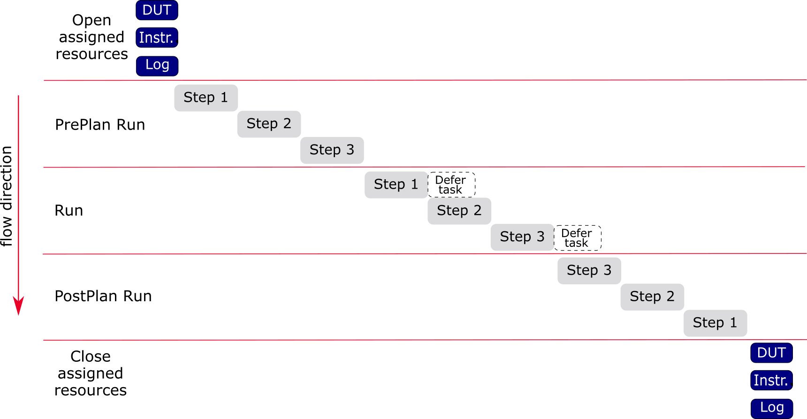
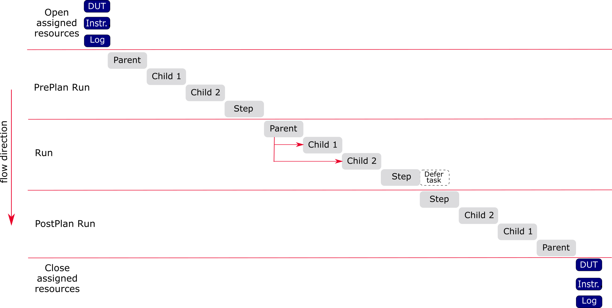

What is OpenTAP?
============
OpenTAP is a software solution for fast and easy development and execution of automated test and/or calibration algorithms. These algorithms control measurement instruments and possibly vendor-specific *devices under test* (DUTs). By leveraging the features of C#/.NET and providing an extendable architecture, OpenTAP minimizes the code needed to be written by the programmer. 

OpenTAP offers a range of functionality and infrastructure for configuring, controlling and executing test algorithms. OpenTAP provides an API for implementing plugins in the form of test steps, instruments, DUTs and more. 

OpenTAP consists of multiple executables, including:
-	OpenTAP (as a dll)
-	Command Line Interface (CLI)
-   Package Manager

Steps frequently have dependencies on DUT and instrument plugins. The development of different plugins is discussed later in this document.

## OpenTAP Architecture
The illustration below shows how OpenTAP is central to the architecture, and how plugins (all the surrounding items) integrate with it.

## OpenTAP

The OpenTAP assembly is the core and is required for any OpenTAP plugin. The most important classes in the OpenTAP are: TestPlan, TestStep, Resource, DUT, Instrument, PluginManager and ComponentSettings. OpenTAP also provides an API, which is used by the CLI, and other programs like a editor GUI. 

## Graphical User Interface

If a graphical user interface is needed you can download the Keysight Test Automation Developer's System (Community or Enterprise Edition). It provide you with both a Software Development Kit (SDK) as well as an Editor GUI

-	The graphical user interface consists of multiple dockable panels. It is possible to extend it with custom dockable panels. For an example, see `TAP_PATH\Packages\SDK\Examples\PluginDevelopment\GUI\DockablePanel.cs` 
-	Users can specify one or more of the following command line arguments when starting the editor GUI:
	
| **Command** | **Description** | **Example** |
| ---    | --------        | --------    |
|**Open**     | Opens the specified test plan file  |   tap editor --open testplan.tapplan       |
| **Add**     | Adds a specific step to the end of the test plan.   |      tap editor --add VerifyWcdmaMultiRx    |
| **Search**  |     Allows PluginManager to search the specified folder for installed plugins. Multiple paths can be searched.     |   tap editor --search `C:\myPlugins`       |

## OpenTAP Command Line Interface 

The OpenTAP CLI is a console program that executes a test plan and allows easy integration with other programs. The CLI has options to configure the test plan execution, such as setting external parameters, configuring resources and setting meta data.

## OpenTAP API

The OpenTAP API allows a software to configure and run a test plan. A help file for the C# API (OpenTAPApiReference.chm) is available in the OpenTAP installation folder. Examples on how to use the OpenTAP API can be found in the **TAP_PATH** folder.

## OpenTAP Plugins

An essential feature of OpenTAP is its flexible architecture that lets users create plugins. **OpenTAP plugins** can be any combination of TestStep, Instrument, and DUT implementations. Other OpenTAP components such as Result Listeners and Component Settings are also plugins. By default, OpenTAP comes with plugins covering basic operations, such as flow control and result listeners.  

Plugins are managed by the **PluginManager**, which by default searches for assemblies in the same directory as the running executable (the GUI, CLI or API). Additional directories to be searched can be specified for the GUI, the CLI and the API. When using the API, use the PluginManager.DirectoriesToSearch method to retrieve the list of directories, and add any new directories to the list.

## OpenTAP Packages

OpenTAP plugins and non-OpenTAP files (such as data files or README files) can be distributed as **OpenTAP Packages**. OpenTAP Packages can be managed (installed, uninstalled, etc.) using the Package Manager (described in more details later in this guide).

## Test Plans 

A *test plan* is a sequence of test steps with some additional data attached. Test plans are created via the Editor GUI. Creating test plans is described in the *Graphical User Interface Help* (GuiHelp.chm), accessible within the Editor GUI. Test plan files have the *.TapPlan* suffix, and are stored as xml files.

### Test Plan Control Flow
To use OpenTAP to its full potential, developers must understand the control flow of a running test plan. Several aspects of OpenTAP can influence the control flow. Important aspects include:

-	Test plan hierarchy
-	TestStep.PrePlanRun, TestStep.Run, TestStep.PostPlanRun methods
-	Result Listeners
-	Instruments and DUTs 
-	Test steps modifying control flow

The following test plan uses test steps, DUTs and instruments defined in the **Demonstration** plugin:

The test plan has three test steps, in succession. In this test plan, none of the steps have child steps. A more complex example, with child steps, is presented later in this section. The test plan relies on the resources DUT, Instr. and Log to be available and configured appropriately. The following figure illustrates what happens when this test plan is run:

 
In the **Open assigned resources** phase all DUTs, instruments and configured result listeners are opened in parallel. As soon as all resources are open the **PrePlanRun** methods of the test steps execute in succession. This is followed by the execution of the **Run** methods where all test steps are run one at a time. It is possible to allow a test step to run code after its run is completed. This is done by defining a **defer task** for the test step. To learn more about defer task see the *Plugin Development* folder under *Packages/SDK/Examples*, located in the OpenTAP installation folder.

After the test step run is completed for each test step, **PostPlanRun** is executed, *in reverse order*, for each test step. The final step is **Closing assigned resources** which happens in parallel for all previously opened resources. 

The test plan below illustrates how child test steps are handled:

The methods in the test steps execute in the following order:

Similar to the previous example, test plan execution starts with the **Open assigned resources** phase, followed by the execution of the **PrePlanRun** methods. The PreplanRun methods are executed in the order of the steps in the test plan. Next, the Run method of the Parent step is executed. The Parent step controls the execution order of the Run methods of its child steps. The example above shows the case, where *Parent* calls its child steps sequentially. Following this, the run method of *Step* is executed. The **PostPlanRun** methods are executed in reverse order of placement in the test plan, starting with *Step 2* followed by *Child2*, *Child1* and finally *Parent*. In the last step all assigned resources are closed.

Note that the above examples are very simple. A more advanced test plan may incorporate flow control statements to change execution flow. For example, adding a *Parallel* test step as a parent to child test steps will make the test steps run in parallel. This only affects the run stage, the other stages remain unchanged.

### External Parameters
Editable OpenTAP step settings can be marked as *External*. The value of such settings can be set through the Editor GUI, through an external program (such as OpenTAP CLI), or with an external file. This gives the user the ability to set key parameters at run time, and (potentially) from outside the Editor GUI. You can also use the API to set external parameter values with your own program.

### Manual Resource Connection 

You may want to avoid the time required to open resources at each test plan start. To do so, you may manually open the resources by using the **Connection** button:

Resources opened manually remain open between test plan runs. This eliminates the time required to open and close them for each test plan run. 

**Note**: You must ensure that the resources can be safely used in this manner. For example, if a Dut.Open configures the DUT for testing, you may be required to take the default behavior of opening the resource on every run.

### Testing Multiple DUTs

Test step hierarchies can be built and attributes set to allow certain steps to be child steps of other steps. This hierarchical approach and the possibility of communicating with one or multiple DUTs from a single test step allow for a variety of test flows. 

The following figure illustrates four different approaches where both sequential and parallel execution is used. The upper part of the illustration is the flow; the lower part is the test plan execution showing the corresponding TX and RX test steps. 

-	Flow Option 1 is a simple sequential test plan execution where TX (transmit) and RX (receive) test steps are repeated once for each DUT. In a production environment, this is a simple way to reduce the test/calibration time, because it lets the operator switch in a DUT while the other DUT is being tested. 

-	Options 2 to 4 all consist of the same two test steps: a TX step that controls a *single* DUT and an RX step that allow control of *multiple* DUTs simultaneously. Usually several DUTs can listen to an instrument transmitting a signal at the same time, but calibration instruments (which receive) usually can't analyze more than one TX signal at a time.

-	In Option 2, the TX test step is a child step of the RX step (via the use of the AllowChildrenOfType attribute). Being a child means that the TX step will be executed as a part of the RX step execution. The flow in Option 2 starts by executing the RX test step that brings DUT2 into RX test operation. Then the TX child step runs, bringing DUT1 into TX mode. When the TX child step has finished, the RX test step continues for DUT1. 

-	Options 3 and 4 reuse the functionality, but form even more optimized test plan flows. 

**Note**: All the above is highly DUT and instrument dependent. 

