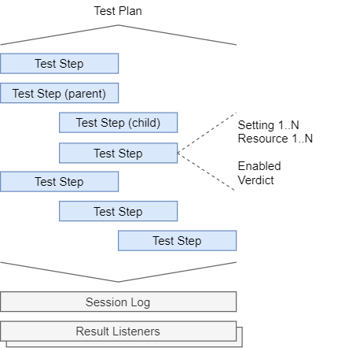

# Overview
This section introduces essential OpenTAP terminology, concepts, and tools. It is intended to provide users
(non-developers) with an understanding of OpenTAP and its ecosystem to get started.

For a quick reference of CLI options, see the [comprehensive reference](../CLI%20Reference). For a more technical
description, see the developer guide.

OpenTAP consists of multiple tools, including:
-	OpenTAP - core engine
-	CLI - command line interface for installed plugins, and
-   Package Manager - a tool to manage installed plugins

This overview is dedicated to OpenTAP itself. A detailed description, along with common usage scenarios, of the latter
two tools will be given in the following chapters.

## Test Plans and Test Steps

A *test plan* is a sequence of test steps and their associated data. They are stored as XML files, and use the
".TapPlan" file extension. Test plans are created with an [editor](../Editors). They can be executed either in an
editor, or by using the `tap run` [CLI action](../CLI%20Usage). It may be useful to consider a test plan as a tree, and
test steps as branches off the tree, that may themselves have branches. The execution order of child steps are decided
by the parent. For example, two typical parent steps are *Parallel* and *Sequential*.

The figure below gives a high-level overview of a test plan, and illustrates an example step hierarchy.

    

The step sequence is ordered from top to bottom, and indented steps are children of the previous step at a lesser indentation level.

### Test Steps

A test step is an element which encapsulates some piece of functionality. It should perform a single *step* of the test
being run. The definition given is intentionally vague, as a step can perform a myriad of actions. It could make a
measurement using an instrument, or control a piece of hardware such as adjusting fan speed or voltage. It could also
[pause test exection](../test%20steps#delay-step), [open a dialog window](../test%20steps#dialog-step), make a web
request, [run a different program](../test%20steps#run-program-step), or [control the execution of other
steps](../test%20steps#flow-control).

The *associated data* of test steps mentioned previously can be seen in the figure, namely *step settings* and
*resources*. *Enabled* is a generic setting available on any step indicating whether or not it should be run, useful for
temporarily disabling certain steps without making destructive changes to a plan. In addition, all steps can be named.
Steps do not have a verdict attached, but many steps generate verdicts when run. All of these elements are shown inside
of the test plan because they directly affect the execution behavior of the test.

On the other hand, *Session Log* and *Result Listeners* are situated outside of the test plan because they interpret the
output of the test, and do not influence it directly. Ensuring this decoupling between generation and interpretation of
results guarantees that, say, a new database can be added to store results without wondering if some of the results will
get lost, or if the behavior of the test will change. Result listeners are discussed in more detail in the [editor
section](../Editors).

<!-- For further discussion of test steps, see the [test step discussion section](../Test%20Steps). -->

### Verdicts

All steps output a verdict to indicate success. If no verdict is generated by a step, they generate the *NotSet*
verdict. A test plan also outputs a verdict according to the verdicts of its steps. Specifically, the verdict of a test
plan is the most *severe* verdict of its child steps. A verdict has one of 6 severities, detailed in the table
below.
| Severity | Verdict      | Description                                                        |
|:----------:|:--------------|:--------------------------------------------------------------------|
| 1        | NotSet       | No verdict was set                                                 |
| 2        | Pass         | Step or plan passed                                                |
| 3        | Inconclusive | Insufficient information to make a decision either way             |
| 4        | Fail         | Step or plan failed                                                |
| 5        | Aborted      | User aborted test plan                                             |
| 6        | Error        | An error occurred. Check [logs](#log%20files) for more information |

This means that, for a test plan to output the *Pass* verdict, at least one step must generate the *Pass* verdict, and
the rest must either generate the *Pass* or *NotSet* verdict. This is also the most typical behavior for parent steps
containing child steps; a *Sequential* step passes if all of its children pass. However, this is not a rule. Parent
steps decide their own verdict conditions.

### Resources

OpenTAP is intended for software as well as hardware testing. The concept of Instruments and DUTs are essential for
OpenTAP, In the classical case, the DUT is the device being tested, calibrated, or controlled, and an instrument is
anything that makes measurements. To integrate resources into test plans, whether to control or measure them, they must
be connected to test steps that know how to communicate with them. In other words, a resource driver is required.
Creation of such a driver is described [here](Developer%20Guide/Instrument%20Plugin%20Development/#instrument-plugin-development) in the developer guide.

OpenTAP is quite flexible regarding resources. Typically, they would be local, physical equipment. But they can easily
be more abstract, such as a virtual resource, or even a remote resource. Depending on your use case, all of the
following scenarios are valid:

 1. Having no DUTs or instruments
 2. Using a single device as a DUT and an instrument simultaneously
 3. Using software resources as DUTs or instruments
 4. Using many DUTs and instruments

Out of the box, OpenTAP does not support any hardware. For that, you need plugins.

### Result Listeners

Result listeners are notified whenever a test step generates log output, or publishes results.

OpenTAP ships with a simple result listener called *Text Log*, which saves log information from a test plan run to a
file. Its behavior can be modified by settings, changing the file name and location of the log, as well as filtering the
log information. There are 4 message categories: Errors, Warnings, Information, and Debug.

Analoguous to *Text Log*, there is a free result listener plugin named [*CSV*]. Rather than log information, this plugin
saves all results published by test steps to a CSV file, which can also be changed by settings.

There are also PostgreSQL and SQLite result listeners that store all results and logs from test plan runs. They can, of
course, be configured to use either a local database or publish to a remote database.

There is no limit to the number of active result listeners, and you can have multiple result listeners of the same type.
For example, you could create two different *Text Log* listeners collecting Debug and Information log messages,
respectively. There are more result listeners available in the package repository, and developers can [make new result
listener plugins](../../Developer%20Guide/Result%20Listener/#custom-result-listeners) to suit their needs.

Note that result listeners are tied to an OpenTAP installation, and not a test plan. Result listener settings are stored
in `%TAP_PATH%/Settings/Results.xml`. Like test plans, we do not recommend editing these by hand. However, they can be
generated and edited using our test plan editors. Therefore, creation and further usage of result listeners will be
covered in more detail in the [editor section](../Editors).

## Log Files

OpenTAP keeps extensive logs for debugging purposes. Logs are kept from the 10 latest OpenTAP instances launched. They
can be found in `%TAP_PATH%/SessionLogs`, and are named after the time and date at which they were created. They contain
the same information you would see in your terminal when running tap with the `--verbose` flag. If you encounter errors,
the logs may contain useful information in discovering what went wrong. If you think you discovered a bug in OpenTAP,
please file an issue on [gitlab](https://gitlab.com/OpenTAP/opentap). If applicable, please include instructions on how
to replicate the issue, as well as relevant logs.

## Plugins

OpenTAP can be extended by installing plugins. Plugins range widely in the additional functionality they provide. Some
examples are:
 - GUI editors for creating and running test plans
 - SDK plugins to aid in developing plugins
 - Tools for analyzing test plans in real time to discover performance bottlenecks
 - REST interface to OpenTAP to allow you to control it remotely

Installing, uninstalling, upgrading, downgrading, and dependencies are all managed by the OpenTAP package manager. Usage
of the package manager is described in detail in [the next section](../cli%20guide/package%manager).

The below figure shows the relation between plugins and OpenTAP. OpenTAP is at the center, and plugins, providing a
variety of functionality, can be added and removed painlessly. 

All plugins depend on OpenTAP, and plugins may or may not depend on each other. The package manager automatically
resolves these dependencies, if a resolution exists.

Check out our public package repository [here](http://packages.opentap.io/index.html#/?name=OpenTAP) to browse available
plugins.
